<!--
  README · Daniel Matias (@CapMatias)
  Paleta: #0D1117 fundo · #1F6FEB / #58A6FF azul · #C9D1D9 / #E6EDF3 texto
-->

<p align="center">
  
</p>

<p align="center">
  <a href="https://github.com/CapMatias">
    
  </a>
</p>

<br />

## ▸ Sobre mim

<table>
<tr>
<td width="52%" valign="top">

Sou **Daniel Matias**, engenheiro de software.

Trabalho com **Next.js**, **Vue** e **TypeScript** no front-end, **PHP** e **Blade** no lado do servidor, e desenvolvo **interfaces 3D** para a web.

<!--
  Espaço seu: escreva aqui, com as suas palavras, o que você está construindo agora,
  o que te interessa ou o que quer aprender. Duas ou três linhas bastam.
-->

</td>
<td width="48%" valign="top">

```ts
const daniel = {
  cargo: "Engenheiro de Software",
  front: ["Next.js", "React", "Vue", "TypeScript"],
  mobile: ["React Native", "Expo"],
  back: ["Node.js", "Express", "PHP", "Spring Boot"],
  extra: "Interfaces 3D com Spline",
};
```

</td>
</tr>
</table>

## ▸ Tecnologias

<p align="center"><sub><b>LINGUAGENS</b></sub></p>
<p align="center">
  
</p>

<p align="center"><sub><b>FRONT-END · MOBILE · 3D</b></sub></p>
<p align="center">
  
</p>
<p align="center">
  
  
  
  
</p>

<p align="center"><sub><b>BACK-END · DADOS</b></sub></p>
<p align="center">
  
</p>
<p align="center">
  
</p>

<p align="center"><sub><b>DEPLOY · FERRAMENTAS</b></sub></p>
<p align="center">
  
</p>

## ▸ Projetos

<p align="center">
  <a href="https://github.com/CapMatias/AtivaMente-MVP">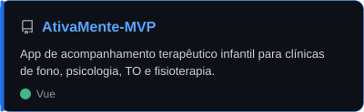</a>
  <a href="https://github.com/CapMatias/DMusic">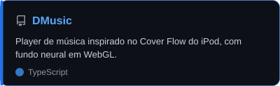</a>
</p>
<p align="center">
  <a href="https://github.com/CapMatias/Fotos.Vinho-Novo">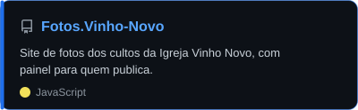</a>
  <a href="https://github.com/CapMatias/ficha_de_novos_membros">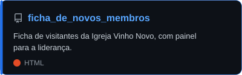</a>
</p>
<p align="center">
  <a href="https://github.com/CapMatias/Site-AtivaMente">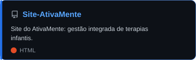</a>
  <a href="https://github.com/CapMatias/site-dentista">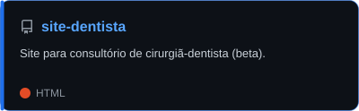</a>
</p>
<p align="center">
  <a href="https://github.com/CapMatias/lista-de-tarefas">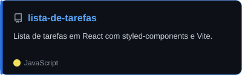</a>
  <a href="https://github.com/CapMatias/Churrasco-Ohana">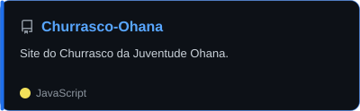</a>
</p>
<p align="center">
  <a href="https://github.com/CapMatias/Arraia-da-rua">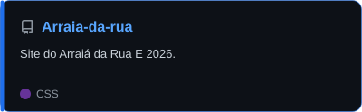</a>
  <a href="https://github.com/CapMatias/Celula">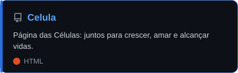</a>
</p>
<p align="center">
  <a href="https://github.com/CapMatias/Aleatorio">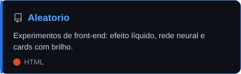</a>
  <a href="https://github.com/CapMatias/Faculdade.Diego">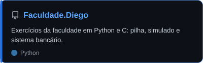</a>
</p>
<p align="center">
  <a href="https://github.com/CapMatias/Faculdade.Giuliano">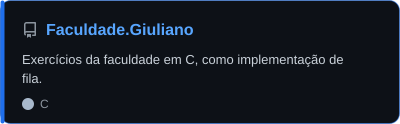</a>
</p>

<!--
  Para adicionar um projeto: copie um arquivo de projetos/, troque nome, descrição e linguagem
  dentro do SVG, e acrescente um <a href=...></a> acima.
-->

## ▸ No GitHub

<p align="center">
  
</p>

<p align="center">
  
  
</p>

<p align="center">
  
</p>

<p align="center">
  <picture>
    <source media="(prefers-color-scheme: dark)" srcset="https://raw.githubusercontent.com/CapMatias/CapMatias/output/snake.svg" />
    <source media="(prefers-color-scheme: light)" srcset="https://raw.githubusercontent.com/CapMatias/CapMatias/output/snake-light.svg" />
    
  </picture>
</p>

## ▸ Onde me encontrar

<p align="center">
  <a href="https://www.instagram.com/daniel__matias1/" title="Instagram · @daniel__matias1">
    
  </a>
  &nbsp;
  <a href="https://github.com/CapMatias" title="GitHub · @CapMatias">
    
  </a>
  <!--
    LinkedIn: troque SEU-USUARIO e remova o comentário.
  &nbsp;
  <a href="https://www.linkedin.com/in/SEU-USUARIO/" title="LinkedIn">
    
  </a>
  -->
</p>

<p align="center">
  <sub>instagram <code>@daniel__matias1</code> · github <code>@CapMatias</code></sub>
</p>

<br />

<p align="center">
  <sub>Obrigado pela visita. Até o próximo commit.</sub>
</p>


